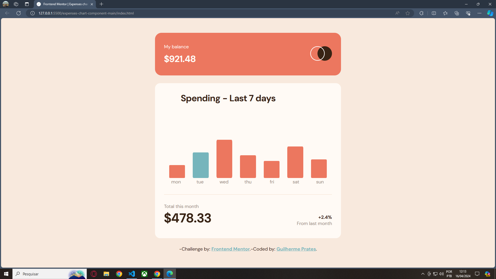
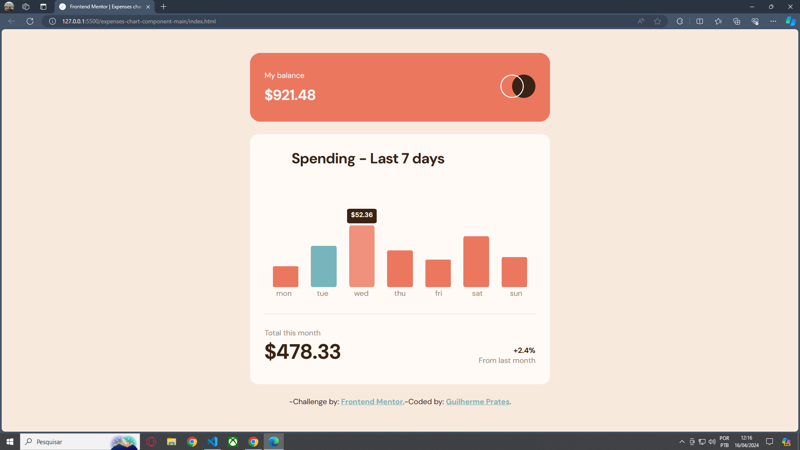
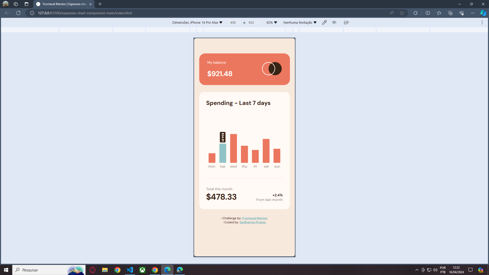

# Projeto básico Gráfico de Despesas

## Descrição 📝
Criação de um website apresentando um gráfico de barras dinâmico **(arquivo JSON)** para calculo de despesas, apresentando o valor de cada dia da semana, valor total do mês anterior e diferença percentual entre o mês anterior e o mês atual.
### Liguagens | Ferramentas | Skills
> - HTML
> - CSS
> - JS
> - JSON
> - Responsividade

### site
[expenses-chart-component-main](https://prates14.github.io/expenses-chart-component-main/)

## História Resumo 👨‍💻
Após ficar um certo tempo focado em estudos teóricos na área de **Ciência da Computação**, precisava voltar a praticar na criação de projetos para não "enferrujar". Então pensei em fazer este projeto básico e evoluir a partir dele, criando assim, websites cada vez mais avançados e complexos.

## Fonte de Criação 🔎
Esse projeto foi criado seguindo o desafio proposto do site [Frontend Mentor](https://www.frontendmentor.io), onde o objetivo é construir o componente e fazer com que pareça o mais próximo possível do design.

Pode usar qualquer ferramenta que desejar para ajudar a completar o desafio. Então, posso usar algo que gostaria de praticar.

>O arquivo [README](./README-challenger.md) feito pelo **frontend Mentor**, tem mais informações sobre a realização do desafio.

## Imagens 📷
As imagens a seguir são o resultado final do meu desenvolvimento neste desafio. A versão original proposta pelo desafio é encontrado na pasta `/design`.

### Versão Desktop

### Versão Desktop active-states

### Versão Mobile
